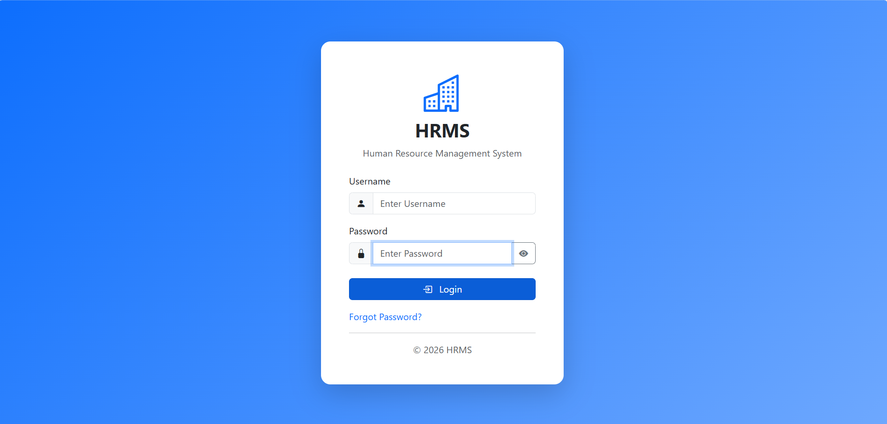
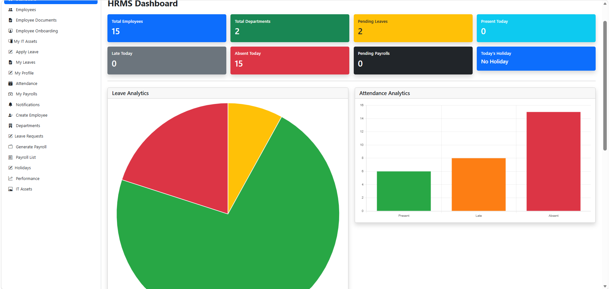
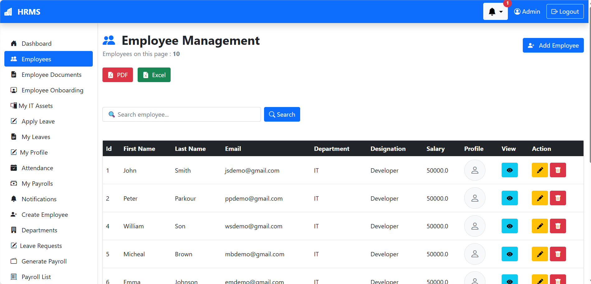
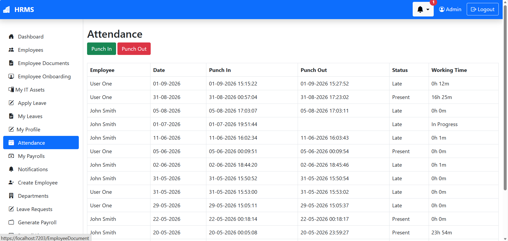
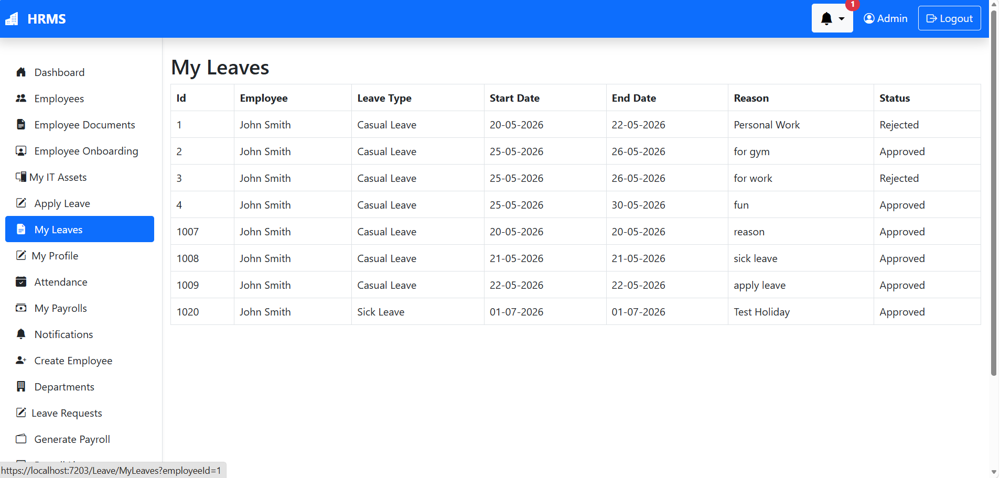
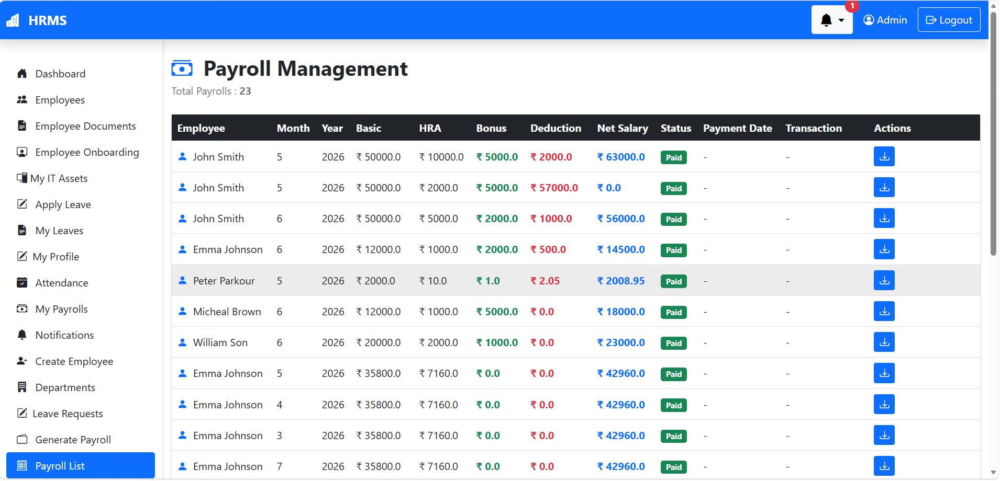

🏢 HRMS Management System

A full-stack Human Resource Management System (HRMS) built with ASP.NET Core 8 Web API and ASP.NET Core MVC.

The system provides a centralized platform for managing employees, attendance, leaves, payroll, performance reviews, onboarding, documents, IT assets, notifications, holidays, and other HR-related operations.

📌 Overview

HRMS Management System is a real-world .NET application designed to manage common Human Resource operations through a centralized web application.

The project is divided into two major applications:

HRMSAPI — ASP.NET Core Web API backend

HRMSWEB — ASP.NET Core MVC web application

The backend uses Entity Framework Core with Microsoft SQL Server for data persistence and JWT-based Authentication & Authorization for securing API endpoints.

The application follows a layered architecture using:

Controllers

Services

Repositories

DTOs

Entity Models

AutoMapper

Middleware

🚀 Features

🔐 Authentication & Authorization

User Login

User Registration

JWT-based Authentication

Role-based Authorization

BCrypt Password Hashing

Forgot Password

OTP Verification

Password Reset

👨‍💼 Employee Management

Create Employee

Update Employee

Delete Employee

View Employee Details

Employee Search

Server-side Pagination

Department Filtering

Sorting

Profile Image Upload

Department Assignment

Designation Assignment

Shift Assignment

Employee Dropdown

🏢 Department Management

Create Department

Update Department

Delete Department

View Departments

💼 Designation Management

Create Designation

Update Designation

Delete Designation

View Designations

🕐 Shift Management

Create Shift

Update Shift

Delete Shift

Active / Inactive Shift Handling

Employee Shift Assignment

🗓️ Attendance Management

Employee Attendance

Punch In

Punch Out

Attendance History

Attendance Records

Attendance Dashboard Information

🏖️ Leave Management

Apply for Leave

View Leave Requests

Approve Leave

Reject Leave

Leave Types

Leave Balance

Employee Leave Records

💰 Payroll Management

Generate Payroll

View Payroll Records

Employee Payroll

Payroll Approval

Mark Payroll as Paid

📊 Performance Management

Create Performance Reviews

Update Performance Reviews

Delete Performance Reviews

View Performance Reviews

Employee-specific Performance Records

👋 Employee Onboarding

Create Onboarding Records

Update Onboarding Information

Delete Onboarding Records

View Onboarding Details

Onboarding Completion Tracking

📄 Employee Documents

Upload Employee Documents

View Documents

Update Document Information

Delete Documents

Document Preview

💻 IT Asset Management

Create IT Assets

Update IT Assets

Delete IT Assets

View IT Assets

Employee Asset Assignment

My Assets

🎉 Holiday Management

Create Holidays

Update Holidays

Delete Holidays

View Holidays

Upcoming Holiday Information

🔔 Notification Management

Notification Center

Employee Notifications

Unread Notification Count

Mark Notification as Read

Delete Notifications

Latest Notifications

Notification Bell

📈 Dashboard

Employee Statistics

Department Statistics

Pending Leave Information

Attendance Statistics

Recent Employees

Recent Leave Requests

Upcoming Holidays

Dashboard Charts

## 📸 Screenshots

### 🔐 Login

### 📊 Dashboard

### 👥 Employee Management

### 🕒 Attendance Management

### 🏖️ Leave Management

### 💰 Payroll Management

---

🛠️ Technology Stack

Backend

Technology

Purpose

C#

Programming Language

ASP.NET Core 8 Web API

Backend API

Entity Framework Core

ORM / Data Access

Microsoft SQL Server

Database

JWT

Authentication

AutoMapper

Object Mapping

BCrypt.Net

Password Hashing

Swagger / OpenAPI

API Documentation & Testing

ASP.NET Core Memory Cache

Caching

MailKit

Email / SMTP

Frontend

Technology

Purpose

ASP.NET Core MVC

Web Application

Razor Views

Server-side UI

HTML5

Markup

CSS3

Styling

JavaScript

Client-side functionality

Bootstrap

UI Framework

Additional Libraries

Newtonsoft.Json

ClosedXML

iTextSharp

🏗️ Architecture

The application follows a layered architecture that separates presentation, business logic, data access, and database responsibilities.

                          ┌─────────────────────────┐
                          │        HRMSWEB          │
                          │   ASP.NET Core MVC      │
                          │                         │
                          │ Controllers             │
                          │ Models                  │
                          │ Views                   │
                          │ wwwroot                 │
                          └────────────┬────────────┘
                                       │
                                       │ HTTP / JSON
                                       ▼
                          ┌─────────────────────────┐
                          │        HRMSAPI          │
                          │ ASP.NET Core Web API    │
                          │                         │
                          │ Controllers             │
                          │ Middleware              │
                          │ DTOs                    │
                          │ Services                │
                          │ Repository              │
                          │ Mappings                │
                          └────────────┬────────────┘
                                       │
                                       ▼
                          ┌─────────────────────────┐
                          │   Entity Framework Core │
                          └────────────┬────────────┘
                                       │
                                       ▼
                          ┌─────────────────────────┐
                          │      SQL Server         │
                          └─────────────────────────┘

📂 Project Structure

HRMSAPI
│
├── Entities
│   └── Entity Models
│
├── Helpers
│   └── Helper Services
│
├── HRMSAPI
│   │
│   ├── Controllers
│   │   └── API Controllers
│   │
│   ├── Data
│   │   └── Database Context
│   │
│   ├── DTOs
│   │   └── Data Transfer Objects
│   │
│   ├── Helpers
│   │   └── API Helper Components
│   │
│   ├── Mappings
│   │   └── AutoMapper Profiles
│   │
│   ├── Middleware
│   │   └── Exception Handling and Logging
│   │
│   ├── Repository
│   │   └── Data Access Layer
│   │
│   └── Services
│       └── Business Logic Layer
│
├── HRMSWEB
│   │
│   ├── Controllers
│   │   └── MVC Controllers
│   │
│   ├── Models
│   │   └── View Models
│   │
│   ├── Views
│   │   └── Razor Views
│   │
│   └── wwwroot
│       └── Static Files and Uploads
│
└── Utilities
    └── Utility Components

🔑 Authentication Flow

The application uses JWT-based authentication to secure API requests.

User Login
    │
    ▼
Username / Password
    │
    ▼
Credential Verification
    │
    ▼
JWT Token Generation
    │
    ▼
Web Application Stores Token
    │
    ▼
Bearer Token Sent with API Request
    │
    ▼
JWT Authentication
    │
    ▼
Role-based Authorization
    │
    ▼
Protected API Resource

🌐 API

The backend provides REST-style API endpoints for the major HR modules.

Main API Areas

/api/Auth
/api/Employee
/api/Department
/api/Designation
/api/Shift
/api/Attendance
/api/Leave
/api/LeaveType
/api/Payroll
/api/PerformanceReview
/api/EmployeeOnboarding
/api/EmployeeDocument
/api/ITAsset
/api/Holiday
/api/Notification
/api/Dashboard

Swagger / OpenAPI

Swagger / OpenAPI is enabled for API exploration and development-time testing.

📄 Pagination

Employee listing uses server-side pagination.

The API provides pagination information including:

Current Page

Page Size

Total Records

Total Pages

Previous Page Availability

Next Page Availability

Search and pagination work together, meaning pagination is calculated from the filtered result set.

Example

Total Employees : 15
Page Size       : 10
Total Pages     : 2

Page 1
10 Employees
Previous: Disabled
Next: Enabled

Page 2
5 Employees
Previous: Enabled
Next: Disabled

✅ Validation

The application implements validation and business-rule checks for various operations.

Examples include:

Required employee profile image

Salary range validation

Duplicate employee email validation

Department existence validation

Designation existence validation

Active shift validation

Authentication credential validation

OTP verification

Resource existence validation

🛡️ Error Handling & Logging

The API includes middleware for centralized error handling and request logging.

This provides a common mechanism for:

Handling unhandled exceptions

Returning API errors

Logging incoming requests

Improving debugging and diagnostics

🗄️ Database

The application uses:

Microsoft SQL Server

Entity Framework Core

Entity Models

Repository-based Data Access

The database connection is configured through application configuration.

⚙️ Configuration

Sensitive configuration values should not be committed to the public repository.

Use:

HRMSAPI/appsettings.Example.json

as the configuration template.

Local configuration contains settings such as:

SQL Server Connection String

JWT Secret Key

JWT Issuer

JWT Audience

SMTP Configuration

Example Configuration

{
  "ConnectionStrings": {
    "DBCS": "YOUR_SQL_SERVER_CONNECTION_STRING"
  },

  "Jwt": {
    "Key": "YOUR_JWT_SECRET_KEY",
    "Issuer": "HRMSAPI",
    "Audience": "HRMSUSER"
  }
}

⚠️ Important: Never commit real database credentials, JWT secrets, SMTP credentials, or other sensitive information to source control.

▶️ How to Run

Prerequisites

Make sure the following are installed:

.NET 8 SDK

Visual Studio 2022 or later

SQL Server / LocalDB

Git

1. Clone the Repository

git clone https://github.com/pradeeprathore-dev/HRMS-Management-System.git

2. Open the Solution

Open the following solution in Visual Studio:

HRMSAPI.slnx

3. Configure the Database

Create your local configuration using:

HRMSAPI/appsettings.Example.json

Provide your local SQL Server connection string.

4. Configure JWT

Add your local JWT configuration:

"Jwt": {
  "Key": "YOUR_LOCAL_SECRET_KEY",
  "Issuer": "HRMSAPI",
  "Audience": "HRMSUSER"
}

5. Configure Email

If password reset or email functionality is being used, configure the required SMTP settings in your local configuration.

6. Run the Application

Start the required projects from Visual Studio.

The API provides Swagger for development-time API testing.

🔒 Security

The application implements several security-related practices:

JWT Authentication

Role-based Authorization

BCrypt Password Hashing

Server-side Validation

Protected API Endpoints

Local configuration for sensitive settings

Secrets excluded from source control

📌 Project Highlights

This project demonstrates practical implementation of:

Full-stack .NET development

ASP.NET Core Web API

ASP.NET Core MVC

Entity Framework Core

SQL Server

JWT Authentication

Role-based Authorization

Repository Pattern

Service Layer

DTO-based API design

AutoMapper

Middleware

Server-side Pagination

Search & Filtering

Validation & Business Rules

File Uploads

Email / SMTP Integration

Memory Caching

Swagger / OpenAPI

HR workflow management

📄 License

This project is intended for learning, development, and demonstration purposes.